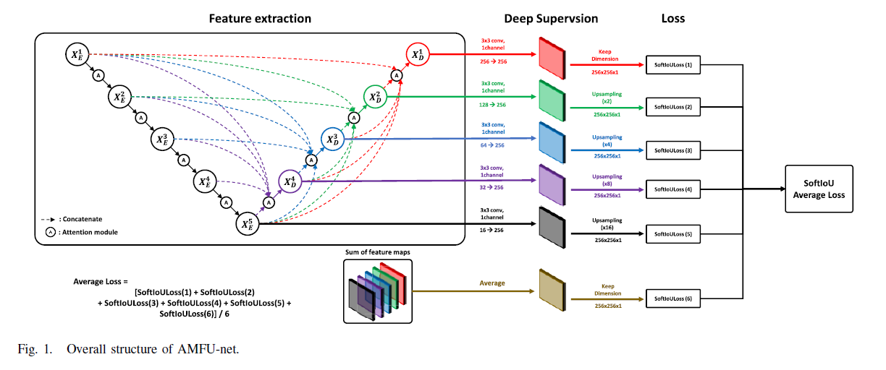

# Attention Multiscale Feature Fusion U-Net (AMFU-net)

**Authors : Won Young Chung, In Ho Lee, and [Chan Gook Park](https://scholar.google.com/citations?user=9gwkQ7AAAAAJ&hl=en)**


### 1. Overview

 
This is a pytorch implementation of Attention Multiscale Feature Fusion U-Net(AMFU-net).[[Paper]](https://ieeexplore.ieee.org/abstract/document/10124752)

We propose a lightweight infrared small target detection network which performs effective small target detection by fusiong feaure maps obtained from each layer stage. Inspired by the [DNA-net](https://github.com/YeRen123455/Infrared-Small-Target-Detection), we designed an IRSTD network using attention modules and UNet3+, a U-net based network that fuses features through a full-scale skip connection between the encoder and the decoder without using dense convolutions.


### 2. Prerequisites 
#### Hardware & Software 
* Tested on Ubuntu 20.04 
* Python 3.7.16, Pytorch 1.7.1 with CUDA 11.0, Torchvision 0.8.2
* RTX 3090 GPU with 64GB RAM

#### Dataset
* ACM-dataset(NUAA-SIRST)  [Dataset](https://github.com/YimianDai/open-acm)


### 3. Run
#### Training 
* Change the path(--root, etc..) in utils/parse_args_train.txt

```
python train.py
```

#### Test
* Change the path(--root, etc..) in utils/parse_args_test.txt

```
python test.py
```

#### Demo
* Change the path (img_demo_dir, checkpoint path)

```
python demo.py
```

#### Demo mp4
* Multiframe infrared small target detection
* _for_save : Save result video

```
python demo_mp4.py
python demo_mp4_for_save.py
```

* MP4 results 


### 4. Results
#### Qualitative analysis (Single frame)
[Q_single_img](./pic/Qualitative.PNG)

#### Quantitative analysis (Single frame)
[Qunt_single_img](./pic/Quantitative.PNG)


### 5. Citation

If you feel this work helpful to your academic research, we kindly ask you to cite our paper :

```
@article{chung2023lightweight,
  title={Lightweight Infrared Small Target Detection Network Using Full-Scale Skip Connection U-Net},
  author={Chung, Won Young and Lee, In Ho and Park, Chan Gook},
  journal={IEEE Geoscience and Remote Sensing Letters},
  year={2023},
  publisher={IEEE}
}
```

### 6. Acknowledgements

This work was supported by the Artificial Intelligence Based Flight Control Research Laboratory funded by the Defense Acquisition Program Administration under Grant UD230014SD.


### 7. Special Thanks to 

This code is highly borrowed from [DNA-net](https://github.com/YeRen123455/Infrared-Small-Target-Detection). Thank to authors.

```
@article{DNANet,
  title={Dense nested attention network for infrared small target detection},
  author={Li, Boyang and Xiao, Chao and Wang, Longguang and Wang, Yingqian and Lin, Zaiping and Li, Miao and An, Wei and Guo, Yulan},
  journal={IEEE Transactions on Image Processing},
  year={2023},
  volume={32},
  pages={1745-1758},
  publisher={IEEE}
}
```

Dataset from [ACM(NUAA-SIRST)](https://github.com/YimianDai/open-acm). Thanks to authors.

```
@inproceedings{dai21acm,
  title   =  {Asymmetric Contextual Modulation for Infrared Small Target Detection},
  author  =  {Yimian Dai and Yiquan Wu and Fei Zhou and Kobus Barnard},
  booktitle =  {{IEEE} Winter Conference on Applications of Computer Vision, {WACV} 2021}
  year    =  {2021}
}
```